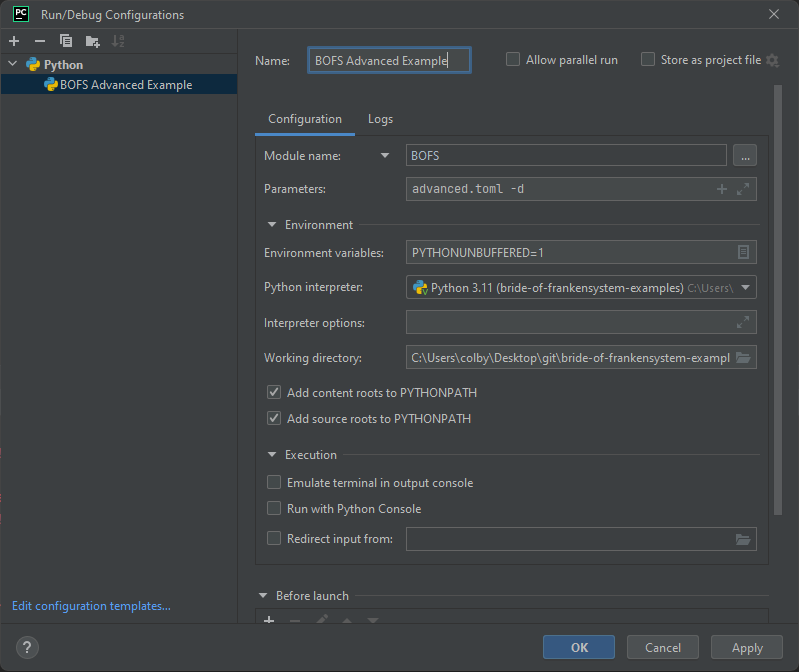

# bride-of-frankensystem-examples
Example projects for the Bride of Frankensystem.

## Instructions
To run the examples, ensure that BOFS is installed via pip and use the `BOFS` command from your command line.

### Minimal Example
The minimal example is a minimal project that only contains questionnaires.

To run the example, ensure that your working directory is the same directory as the `.toml` file and run:
 - `BOFS minimal.toml -d` for the debug version (for development).
 - `BOFS minimal.toml` for the production version.

### Advanced Example
The advanced example is a project that demonstrates most of the capabilities of Bride of Frankensystem.

To run the example, ensure that your working directory is the same directory as the `.toml` file and run:
 - `BOFS advanced.toml -d` for the debug version (for development).
 - `BOFS advanced.toml` for the production version.

### Unity Example
The `unity_example` demonstrates one approach for integrating a Unity project into BOFS. It includes source code for a
Unity project alongside the BOFS project.

To run the example, ensure that your working directory is the same directory as the `.toml` file and run:
 - `BOFS unity_example.toml -d` for the debug version (for development).
 - `BOFS unity_example.toml` for the production version.

## Running in PyCharm

Run BOFS as a module, set the working directory to the example project you're interested in, and specify the `.toml` file for that project.

