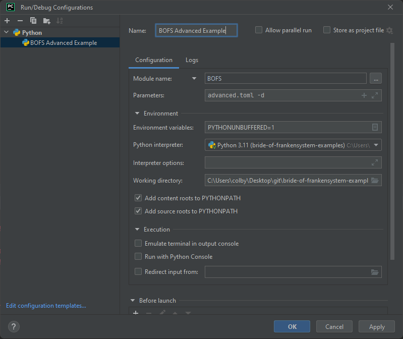

# bride-of-frankensystem-examples
Example projects for the Bride of Frankensystem.

## Instructions
The example projects will run if BOFS has been installed via pip. You must use the `BOFS` command from your command 
line to start each project.

It is recommended that you install BOFS via a virtual environment. The steps for doing this are:
1. Create the venv with: `python -m venv bofs_venv`
2. Activate the venv.
   * In Windows this is done via `.\bofs_venv\Scripts\activate.bat` if using `cmd` or `.\bofs_venv\Scripts\Activate.ps1` 
     if using Powershell (the default command line in Windows 11).
   * In MacOS or Linux this is done via `source bofs_venv/bin/activate`
3. Install BOFS via pip:
   * `pip install bride-of-frankensystem`
4. Ensure that you can execute the `BOFS` command. Try it without any arguments and you should see a help message.

### Minimal Example
The minimal example is a minimal project that only contains questionnaires.

To run the example, ensure that your working directory is the same directory as the `.toml` file and run:
 - `BOFS minimal.toml -d` for the debug version (for development).
 - `BOFS minimal.toml` for the production version.

### Advanced Example
The advanced example is a project that demonstrates most of the capabilities of Bride of Frankensystem.

To run the example, ensure that your working directory is the same directory as the `.toml` file and run:
 - `BOFS advanced.toml -d` for the debug version (for development).
 - `BOFS advanced.toml` for the production version.

### Unity Examples
Two parallel examples demonstrate one approach for integrating a Unity WebGL build into BOFS. Each contains both a
ready-to-run BOFS project (`bofs_project/`) and the Unity source project (`unity_project/`) that produced the build,
so you can run them as-is or rebuild after editing the scene/script. Pick whichever matches your local Unity install:

 - `unity_example_2021.1/` — Unity 2021.1.
 - `unity_example_2023.2/` — Unity 2023.2.

Both examples cover the same integration points: hosting the WebGL build (in three layouts: BOFS-chrome, fullscreen,
fully custom), pushing the participant ID into the running build, reading the assigned condition from inside Unity,
posting data back to a custom database table, and advancing the BOFS page flow from within Unity. See each
example's own `README.md` for the run command, port, and a walkthrough of the integration.

### Embedding Media Example
The `embedding_media_example` demonstrates every place that media (images and videos)
can be embedded in a study: in custom HTML templates, in questionnaire `instructions`
fields, in `textview` questions, and as their own `video` question (with optional
"force watch" enforcement). It also shows how the project's `static/` folder serves
asset files at `/static/<filename>`.

To run the example, ensure that your working directory is the same directory as the `.toml` file and run:
 - `BOFS embedding_media.toml -d` for the debug version (for development).
 - `BOFS embedding_media.toml` for the production version.

### Branching Example
The `branching_example` demonstrates the two `show_if` features together: questions on a single page that
appear or disappear based on what the participant has answered so far, and a page-level branch that picks
one of two follow-up questionnaires based on a screening answer. See the example's own `README.md` for the
walkthrough.

To run the example, ensure that your working directory is the same directory as the `.toml` file and run:
 - `BOFS branching.toml -d` for the debug version (for development).
 - `BOFS branching.toml` for the production version.

### Longitudinal Example
The `longitudinal_example` is a two-day HCI menu-learning study that demonstrates how to carry condition
assignments forward across sessions using `CONDITIONS_FROM_DB`. Day 0 randomizes participants into a
Linear Menu or Marking Menu learning condition; day 1 looks them up by Prolific ID and runs the matching
recall task. See the example's own `README.md` for the run sequence and an alternative using
`CONDITIONS_FROM_CSV`.

### jsPsych Example
The `jspsych_example` runs a Stroop task implemented with [jsPsych](https://www.jspsych.org/) on a single
page of an otherwise BOFS-driven flow (consent → demographics → instructions → jsPsych task → post-task
questionnaire → end). jsPsych handles trial timing and key capture; BOFS handles questionnaires, condition
assignment, page flow, and storage. Per-trial data is POSTed in a single batch to `/table/jspsych_trials`.
The jsPsych library files are vendored under `jspsych_stroop/static/jspsych/` so the example runs offline.
See the example's own `README.md` for the run sequence.

### lab.js Example
The `labjs_example` is the parallel of `jspsych_example` built with [lab.js](https://lab.js.org/) instead.
The PAGE_LIST and questionnaires are identical; the difference is which JS framework runs the Stroop trials
and the shape of the per-trial data submitted to `/table/labjs_trials`. The lab.js library is vendored under
`labjs_stroop/static/labjs/`. See the example's own `README.md` for the run sequence.

## Running in PyCharm

Run BOFS as a module, set the working directory to the example project you're interested in, and specify the `.toml` file for that project.

